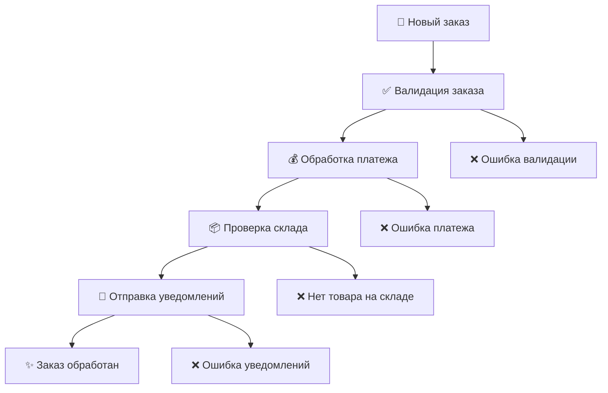

# 🏗️ Pipeline Clean Architecture Pattern

**Полный пример реализации Clean Architecture с Pipeline Pattern для обработки e-commerce заказов**

## 🎯 О проекте

Этот проект демонстрирует **полную реализацию Clean Architecture в сочетании с Pipeline Pattern**. Создан как образцовый шаблон для изучения и понимания архитектурных принципов на практическом примере.

### 💡 Что реализовано:

- ✅ **Полная Clean Architecture** с 4 слоями
- ✅ **Pipeline Engine** для обработки сложных бизнес-процессов  
- ✅ **E-commerce система** обработки заказов
- ✅ **Богатые доменные модели** с бизнес-логикой
- ✅ **Работающие пайплайны** с 4 шагами обработки
- ✅ **Подробная документация** и комментарии в коде

## 🏛️ Архитектура

### Диаграмма слоев

```
┌─────────────────────────────────────────────────────────┐
│                 🌐 INTERFACE LAYER                      │
│             cmd/api, cmd/worker, cmd/pipeline           │
└─────────────────────────────────────────────────────────┘
                               ↓
┌─────────────────────────────────────────────────────────┐
│                🚀 APPLICATION LAYER                     │
│     internal/application/pipeline + pkg/pipeline       │
│         Pipeline Engine, Steps, Services               │
└─────────────────────────────────────────────────────────┘
                               ↓
┌─────────────────────────────────────────────────────────┐
│                  💼 USE CASE LAYER                      │
│              internal/usecase/order_processing          │
│           Interfaces, DTOs, Business Processes         │
└─────────────────────────────────────────────────────────┘
                               ↓
┌─────────────────────────────────────────────────────────┐
│                   🏛️ DOMAIN LAYER                       │
│        internal/domain/order, payment, product         │
│          Entities, Value Objects, Business Rules       │
└─────────────────────────────────────────────────────────┘
                               ↓
┌─────────────────────────────────────────────────────────┐
│               🔧 INFRASTRUCTURE LAYER                   │
│            internal/infrastructure/* (моки)            │
│       Database, External Services, HTTP Clients        │
└─────────────────────────────────────────────────────────┘
```

## 🔄 Pipeline обработки заказа



## 📁 Структура проекта

```
pipeline-clean-architecture/
├── 🚀 cmd/                          # Точки входа приложения
│   ├── api/main.go                  # HTTP API сервер (будущая реализация)
│   ├── worker/main.go               # Background воркер (будущая реализация)
│   └── pipeline/main.go             # 🎯 ДЕМО: Запуск пайплайна
├── 🔒 internal/                     # Внутренняя логика (не экспортируется)
│   ├── 🏛️ domain/                   # ДОМЕННЫЙ СЛОЙ
│   │   ├── order/                   # Доменная модель заказа
│   │   │   ├── entity.go           # ✨ Сущность Order с бизнес-логикой
│   │   │   └── repository.go       # 📋 Интерфейсы репозитория
│   │   ├── payment/                 # Доменная модель платежа
│   │   │   └── entity.go           # ✨ Сущность Payment
│   │   └── product/                 # Доменная модель товара
│   │       └── entity.go           # ✨ Сущность Product
│   ├── 💼 usecase/                  # USE CASE СЛОЙ
│   │   └── order_processing/
│   │       └── interfaces.go       # 📋 Интерфейсы бизнес-процессов
│   └── 🚀 application/              # APPLICATION СЛОЙ
│       └── pipeline/
│           └── order_steps.go      # 🔄 Конкретные шаги пайплайна
├── 📦 pkg/                          # Переиспользуемые компоненты
│   └── pipeline/
│       └── engine.go               # 🎯 CORE: Pipeline Engine
├── 📝 configs/                      # Конфигурация
└── 📚 docs/                         # Документация
    └── ARCHITECTURE_GUIDE.md       # 📖 Подробное руководство
```

## 🎮 Быстрый старт

### 1. Клонирование и установка

```bash
# Переходим в папку проекта
cd PipelineCleanArchitecturePattern

# Устанавливаем зависимости
go mod download
```

### 2. Запуск демонстрации

```bash
# Запускаем демо пайплайна
go run cmd/pipeline/main.go
```

### 3. Ожидаемый результат

```
🚀 Starting Pipeline Clean Architecture Demo
📋 Created test order order_id=xxx customer_id=xxx items_count=2
🔄 Starting pipeline execution pipeline=order_processing
✅ Step completed successfully: validate_order duration=15ms
💰 Processing payment for order xxx
✅ Step completed successfully: process_payment duration=25ms  
📦 Checking inventory for order xxx
✅ Step completed successfully: check_inventory duration=12ms
📧 EMAIL SENT to customer@example.com: Заказ подтвержден
📱 SMS SENT to +7900123456789: Заказ xxx подтвержден
✅ Step completed successfully: send_notifications duration=8ms
✅ Pipeline execution completed successfully! status=completed total_duration=60ms
📦 Final order status: inventory_checked
🎉 Demo completed successfully!
```

## 🎯 Ключевые компоненты

### 1. 🏛️ Domain Layer (Доменный слой)

**Расположение**: `internal/domain/`

**Назначение**: Содержит чистую бизнес-логику без внешних зависимостей

**Компоненты**:
- **Order Entity** (`order/entity.go`) - Заказ с методами валидации, отмены, изменения статуса
- **Payment Entity** (`payment/entity.go`) - Платеж с логикой обработки и возвратов  
- **Product Entity** (`product/entity.go`) - Товар с управлением складом и ценами
- **Repository Interfaces** - Контракты для работы с данными

```go
// Пример: Бизнес-логика в доменной сущности
func (o *Order) CanCancel() bool {
    return o.status != StatusShipped && 
           o.status != StatusDelivered
}

func (o *Order) Cancel() error {
    if !o.CanCancel() {
        return errors.New("cannot cancel order in current status")
    }
    o.status = StatusCancelled
    return nil
}
```

### 2. 💼 Use Case Layer (Слой сценариев использования)

**Расположение**: `internal/usecase/`

**Назначение**: Определяет интерфейсы для бизнес-процессов

**Компоненты**:
- **OrderProcessor** - Интерфейс для обработки заказов
- **PipelineExecutor** - Интерфейс для выполнения пайплайнов
- **Request/Response DTOs** - Структуры для передачи данных

### 3. 🚀 Application Layer (Слой приложения)

**Расположение**: `internal/application/` и `pkg/pipeline/`

**Назначение**: Координирует выполнение бизнес-процессов

**Компоненты**:
- **Pipeline Engine** (`pkg/pipeline/engine.go`) - Универсальный движок пайплайнов
- **Pipeline Steps** (`internal/application/pipeline/order_steps.go`) - Конкретные шаги обработки заказа

### 4. 🔧 Infrastructure Layer (Инфраструктурный слой)

**Расположение**: `cmd/pipeline/main.go` (моки для демо)

**Назначение**: Реализует технические детали

**Компоненты** (в демо как моки):
- **MockOrderRepository** - Имитация базы данных
- **MockPaymentService** - Имитация платежной системы
- **MockInventoryService** - Имитация системы склада
- **MockNotificationService** - Имитация системы уведомлений

## 🔄 Как работает пайплайн

### Поток выполнения

1. **Инициализация**: Создается Pipeline Engine с зарегистрированными шагами
2. **Создание заказа**: Тестовый заказ добавляется в "базу данных"
3. **Запуск пайплайна**: Engine выполняет шаги последовательно
4. **Каждый шаг**:
   - Получает данные от предыдущего шага
   - Выполняет свою логику  
   - Возвращает результат для следующего шага
5. **Результат**: Возвращается общий результат выполнения

### Детальный поток данных

```
Input: { "order_id": "xxx" }
    ↓
Step 1: ValidateOrderStep
    → Проверяет заказ в repository
    → Валидирует бизнес-правила
    → Output: { "is_valid": true, "order_status": "validated" }
    ↓
Step 2: ProcessPaymentStep  
    → Получает validated заказ
    → Обрабатывает платеж через PaymentService
    → Output: { "payment_id": "yyy", "payment_status": "succeeded" }
    ↓
Step 3: CheckInventoryStep
    → Проверяет наличие товаров
    → Резервирует товары в InventoryService  
    → Output: { "all_available": true, "reservation_id": "zzz" }
    ↓
Step 4: SendNotificationsStep
    → Отправляет email и SMS
    → Output: { "successful_notifications": ["email", "sms"] }
    ↓
Result: Pipeline completed successfully
```

## 🔧 Расширение системы

### Добавление нового шага в пайплайн

1. **Создаете новый шаг**:
```go
type ArrangeDeliveryStep struct {
    logger          *zap.Logger
    deliveryService DeliveryService
}

func (s *ArrangeDeliveryStep) Execute(ctx context.Context, data *pipeline.StepData) (*pipeline.StepResult, error) {
    // Логика организации доставки
}
```

2. **Регистрируете в engine**:
```go
deliveryStep := NewArrangeDeliveryStep(logger, deliveryService)
engine.RegisterStep("arrange_delivery", deliveryStep)
```

3. **Добавляете в пайплайн**:
```go
pipelineDefinition := pipeline.PipelineDefinition{
    Steps: []string{
        "validate_order",
        "process_payment", 
        "check_inventory",
        "arrange_delivery", // ← Новый шаг
        "send_notifications",
    },
}
```

### Изменение источника данных

Чтобы перейти с PostgreSQL на MongoDB:

1. **Domain слой** - остается без изменений ✅
2. **Use Case слой** - остается без изменений ✅  
3. **Application слой** - остается без изменений ✅
4. **Infrastructure слой** - создаете новую реализацию:

```go
type MongoOrderRepository struct {
    collection *mongo.Collection
}

func (r *MongoOrderRepository) Save(ctx context.Context, order *order.Order) error {
    // MongoDB реализация
}
```

5. **DI Container** - меняете регистрацию:
```go
// Было:
container.Register((*order.Repository)(nil), &PostgreSQLOrderRepository{})

// Стало: 
container.Register((*order.Repository)(nil), &MongoOrderRepository{})
```

## 🧪 Тестирование

### Unit тесты (доменные сущности)

```bash
go test ./internal/domain/...
```

### Integration тесты (пайплайн шаги)

```bash
go test ./internal/application/...
```

### End-to-End тесты (полный пайплайн)

```bash
go test ./cmd/pipeline/...
```

## 📚 Изучение кода

### Рекомендуемый порядок изучения:

1. **Начните с доменных сущностей**:
   - `internal/domain/order/entity.go` - Основная бизнес-логика
   - `internal/domain/payment/entity.go` - Логика платежей
   - `internal/domain/product/entity.go` - Логика товаров

2. **Изучите интерфейсы**:
   - `internal/usecase/order_processing/interfaces.go` - Контракты

3. **Посмотрите на Pipeline Engine**:
   - `pkg/pipeline/engine.go` - Ядро системы пайплайнов

4. **Изучите конкретные шаги**:
   - `internal/application/pipeline/order_steps.go` - Реализация шагов

5. **Запустите демо**:
   - `cmd/pipeline/main.go` - Полный пример в действии

### Ключевые концепции для понимания:

- **Dependency Injection** - как передаются зависимости
- **Interface Segregation** - маленькие, сфокусированные интерфейсы  
- **Dependency Inversion** - зависимости от абстракций, не реализаций
- **Single Responsibility** - каждый компонент имеет одну ответственность
- **Pipeline Pattern** - разбиение сложного процесса на простые шаги

## 📖 Дополнительная документация

- **📋 Подробное архитектурное руководство**: `docs/ARCHITECTURE_GUIDE.md`
- **🔄 Принципы Pipeline Pattern**: Раздел в руководстве
- **🏛️ Clean Architecture**: Детальное объяснение слоев
- **💡 Практические примеры**: Реальные кейсы расширения системы

## 🚀 Применение в реальных проектах

Эта архитектура отлично подходит для:

- **E-commerce систем** - обработка заказов, платежей, складских операций
- **Workflow engines** - автоматизация бизнес-процессов
- **Системы интеграции** - обработка данных через несколько этапов
- **Микросервисы** - с complex business logic
- **Системы автоматизации** - как твоя система тендеров! 

## 🤝 Связь с твоим проектом тендеров

Эта архитектура напрямую применима к твоей системе:

- **Order** ↔ **Tender** (заказ ↔ тендер)
- **Payment Processing** ↔ **Price Analysis** (обработка платежа ↔ анализ цен)
- **Inventory Check** ↔ **Document Processing** (проверка склада ↔ обработка документов)
- **Notifications** ↔ **Email Campaign** (уведомления ↔ email кампания)

Можешь использовать этот код как основу для своей системы тендеров! 🎯