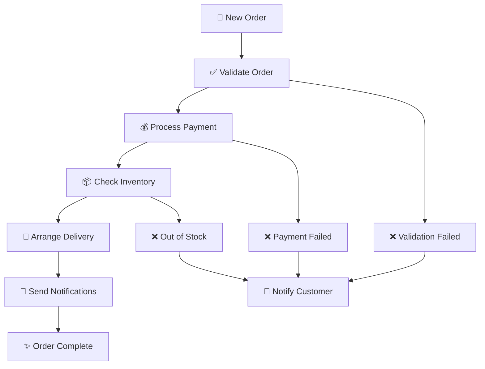

# 🏗️ Pipeline Clean Architecture Pattern

**Пример реализации Clean Architecture с Pipeline Pattern для обработки e-commerce заказов**

## 🎯 Назначение проекта

Этот проект является **образцовым примером** реализации Clean Architecture в сочетании с Pipeline Pattern. Он создан как шаблон для изучения и понимания архитектурных принципов.

### 💡 Что демонстрирует проект:

1. **Clean Architecture** - разделение на слои с четкими границами
2. **Pipeline Pattern** - обработка данных через последовательность этапов
3. **Dependency Injection** - инверсия зависимостей
4. **Domain-Driven Design** - богатые доменные модели
5. **SOLID принципы** - во всех компонентах системы

## 🏛️ Архитектура системы

### 📊 Схема слоев Clean Architecture

```
┌─────────────────────────────────────────────────────────┐
│                    🌐 INTERFACE LAYER                   │
│  ┌─────────────┐  ┌─────────────┐  ┌─────────────┐     │
│  │  HTTP API   │  │  CLI Tools  │  │  Web UI     │     │
│  └─────────────┘  └─────────────┘  └─────────────┘     │
└─────────────────────────────────────────────────────────┘
                               ↓
┌─────────────────────────────────────────────────────────┐
│                 🚀 APPLICATION LAYER                    │
│  ┌─────────────────┐  ┌─────────────────┐              │
│  │  Pipeline Engine │  │  Service Layer  │              │
│  └─────────────────┘  └─────────────────┘              │
└─────────────────────────────────────────────────────────┘
                               ↓
┌─────────────────────────────────────────────────────────┐
│                   💼 USE CASE LAYER                     │
│  ┌───────────────┐ ┌─────────────────┐ ┌─────────────┐ │
│  │ Order Process │ │ Payment Process │ │ Inventory   │ │
│  └───────────────┘ └─────────────────┘ └─────────────┘ │
└─────────────────────────────────────────────────────────┘
                               ↓
┌─────────────────────────────────────────────────────────┐
│                    🏛️ DOMAIN LAYER                      │
│  ┌─────────┐ ┌─────────┐ ┌─────────┐ ┌─────────┐       │
│  │  Order  │ │ Payment │ │ Product │ │Customer │       │
│  └─────────┘ └─────────┘ └─────────┘ └─────────┘       │
└─────────────────────────────────────────────────────────┘
                               ↓
┌─────────────────────────────────────────────────────────┐
│                🔧 INFRASTRUCTURE LAYER                  │
│  ┌───────────┐ ┌───────────┐ ┌─────────┐ ┌───────────┐ │
│  │ Database  │ │ External  │ │  Queue  │ │   HTTP    │ │
│  │   (SQL)   │ │ Services  │ │(Redis)  │ │  Client   │ │
│  └───────────┘ └───────────┘ └─────────┘ └───────────┘ │
└─────────────────────────────────────────────────────────┘
```

## 🔄 Pipeline для обработки заказов



## 📁 Структура проекта

```
pipeline-clean-architecture/
├── cmd/                          # 🚀 Точки входа приложения
│   ├── api/                      # HTTP API сервер
│   ├── worker/                   # Background воркер
│   └── pipeline/                 # Pipeline процессор
├── internal/                     # 🔒 Внутренняя логика приложения
│   ├── domain/                   # 🏛️ Доменный слой
│   │   ├── order/               # Доменная модель заказа
│   │   ├── payment/             # Доменная модель платежа
│   │   ├── product/             # Доменная модель товара
│   │   └── customer/            # Доменная модель клиента
│   ├── usecase/                  # 💼 Сценарии использования
│   │   ├── order_processing/    # Обработка заказов
│   │   ├── payment_processing/  # Обработка платежей
│   │   └── inventory_management/ # Управление складом
│   ├── application/              # 🚀 Слой приложения
│   │   ├── pipeline/            # Пайплайн движок
│   │   └── services/            # Сервисы приложения
│   └── infrastructure/           # 🔧 Инфраструктурный слой
│       ├── database/            # Работа с БД
│       ├── http/                # HTTP клиенты
│       ├── queue/               # Очереди сообщений
│       └── external/            # Внешние сервисы
├── pkg/                          # 📦 Переиспользуемые компоненты
│   ├── logger/                  # Логирование
│   ├── config/                  # Конфигурация
│   ├── pipeline/                # Pipeline framework
│   └── errors/                  # Обработка ошибок
├── configs/                      # ⚙️ Файлы конфигурации
└── docs/                         # 📚 Документация
```

## 🔍 Ключевые принципы

### 1. **Dependency Rule (Правило зависимостей)**
- Зависимости направлены только внутрь
- Внешние слои зависят от внутренних, но не наоборот
- Domain слой не знает ничего о Infrastructure

### 2. **Separation of Concerns (Разделение ответственности)**
- Каждый слой имеет четко определенную ответственность
- Domain - бизнес-логика
- Use Case - сценарии использования
- Application - координация
- Infrastructure - технические детали

### 3. **Pipeline Pattern**
- Обработка данных через последовательность этапов
- Каждый этап независим и тестируем
- Возможность изменения порядка или добавления новых этапов

### 4. **Testability (Тестируемость)**
- Все компоненты легко тестируются изолированно
- Моки для внешних зависимостей
- Unit, integration, end-to-end тесты

## 🚀 Запуск проекта

```bash
# Установка зависимостей
go mod download

# Запуск API сервера
go run cmd/api/main.go

# Запуск воркера
go run cmd/worker/main.go

# Запуск пайплайна
go run cmd/pipeline/main.go
```

## 🧪 Тестирование

```bash
# Запуск всех тестов
go test ./...

# Запуск тестов с покрытием
go test -cover ./...

# Запуск бенчмарков
go test -bench=. ./...
```

## 📖 Дополнительные материалы

- [Clean Architecture by Uncle Bob](https://blog.cleancoder.com/uncle-bob/2012/08/13/the-clean-architecture.html)
- [Pipeline Pattern](https://martinfowler.com/articles/collection-pipeline/)
- [Dependency Injection in Go](https://blog.drewolson.org/dependency-injection-in-go)