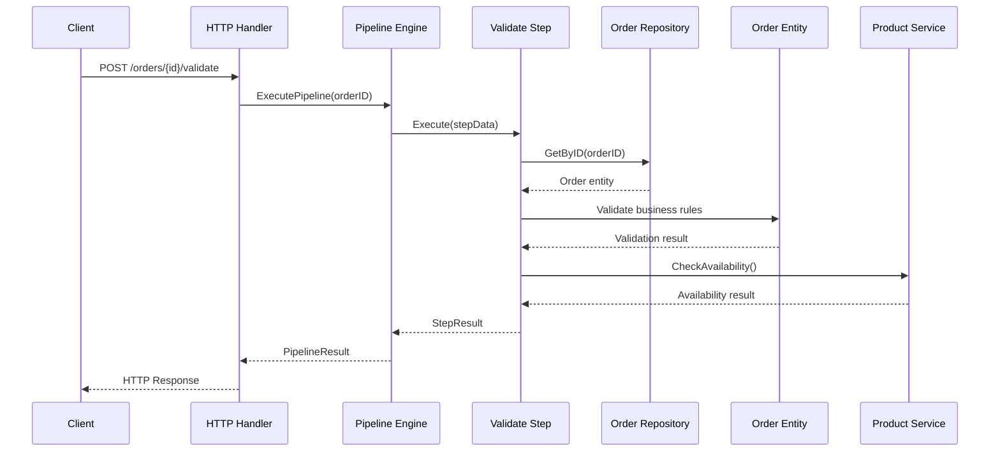

# 🏗️ Pipeline Clean Architecture - Подробное руководство

## 📚 Содержание

1. [Введение в Clean Architecture](#введение)
2. [Pipeline Pattern в деталях](#pipeline-pattern)
3. [Структура слоев](#структура-слоев)
4. [Поток данных](#поток-данных)
5. [Принципы и правила](#принципы-и-правила)
6. [Практические примеры](#практические-примеры)
7. [Тестирование](#тестирование)
8. [Лучшие практики](#лучшие-практики)

## 🎯 Введение в Clean Architecture {#введение}

### Что такое Clean Architecture?

Clean Architecture (Чистая Архитектура) - это архитектурный подход, разработанный Робертом Мартином (Uncle Bob), который фокусируется на разделении ответственности и независимости от внешних фреймворков, баз данных и UI.

### Основные принципы

1. **Dependency Rule (Правило зависимостей)**: Зависимости могут указывать только внутрь. Внешние слои могут зависеть от внутренних, но не наоборот.

2. **Separation of Concerns (Разделение ответственности)**: Каждый слой имеет четко определенную ответственность.

3. **Independence (Независимость)**: Бизнес-логика не зависит от UI, БД, внешних фреймворков.

### Зачем нужна Clean Architecture?

```
✅ ПРЕИМУЩЕСТВА:
• Легко тестировать
• Легко изменять
• Независимость от фреймворков
• Независимость от UI
• Независимость от БД
• Независимость от внешних сервисов

❌ БЕЗ CLEAN ARCHITECTURE:
• Тесно связанный код
• Сложно тестировать
• Изменения затрагивают много файлов
• Зависимость от конкретных технологий
```

## 🔄 Pipeline Pattern в деталях {#pipeline-pattern}

### Что такое Pipeline Pattern?

Pipeline Pattern - это архитектурный паттерн, где данные проходят через последовательность этапов обработки. Каждый этап выполняет определенную трансформацию данных.

```
Входные данные → Этап 1 → Этап 2 → Этап 3 → Результат
```

### Преимущества Pipeline Pattern

1. **Модульность**: Каждый этап независим
2. **Переиспользование**: Этапы можно комбинировать
3. **Тестируемость**: Каждый этап тестируется отдельно
4. **Расширяемость**: Легко добавлять новые этапы
5. **Отказоустойчивость**: Можно обрабатывать ошибки на каждом этапе

### Пример пайплайна обработки заказа


## 🏛️ Структура слоев {#структура-слоев}

### Диаграмма слоев

```
┌─────────────────────────────────────────────────────────┐
│                 🌐 INTERFACE LAYER                      │
│  ┌─────────────┐  ┌─────────────┐  ┌─────────────┐     │
│  │  HTTP API   │  │  CLI Tools  │  │  Web UI     │     │
│  └─────────────┘  └─────────────┘  └─────────────┘     │
└─────────────────────────────────────────────────────────┘
                               ↓
┌─────────────────────────────────────────────────────────┐
│                🚀 APPLICATION LAYER                     │
│  ┌─────────────────┐  ┌─────────────────┐              │
│  │  Pipeline Engine │  │  Service Layer  │              │
│  └─────────────────┘  └─────────────────┘              │
└─────────────────────────────────────────────────────────┘
                               ↓
┌─────────────────────────────────────────────────────────┐
│                  💼 USE CASE LAYER                      │
│  ┌───────────────┐ ┌─────────────────┐ ┌─────────────┐ │
│  │ Order Process │ │ Payment Process │ │ Inventory   │ │
│  └───────────────┘ └─────────────────┘ └─────────────┘ │
└─────────────────────────────────────────────────────────┘
                               ↓
┌─────────────────────────────────────────────────────────┐
│                   🏛️ DOMAIN LAYER                       │
│  ┌─────────┐ ┌─────────┐ ┌─────────┐ ┌─────────┐       │
│  │  Order  │ │ Payment │ │ Product │ │Customer │       │
│  └─────────┘ └─────────┘ └─────────┘ └─────────┘       │
└─────────────────────────────────────────────────────────┘
                               ↓
┌─────────────────────────────────────────────────────────┐
│               🔧 INFRASTRUCTURE LAYER                   │
│  ┌───────────┐ ┌───────────┐ ┌─────────┐ ┌───────────┐ │
│  │ Database  │ │ External  │ │  Queue  │ │   HTTP    │ │
│  │   (SQL)   │ │ Services  │ │(Redis)  │ │  Client   │ │
│  └───────────┘ └───────────┘ └─────────┘ └───────────┘ │
└─────────────────────────────────────────────────────────┘
```

### 1. Domain Layer (Доменный слой) 🏛️

**Назначение**: Содержит бизнес-логику и правила

**Что находится здесь**:
- Entities (Сущности) - основные бизнес-объекты
- Value Objects - объекты-значения
- Domain Services - доменные сервисы
- Repository Interfaces - интерфейсы репозиториев

**Правила**:
- ❌ НЕ зависит от других слоев
- ❌ НЕ знает о БД, HTTP, UI
- ✅ Содержит только бизнес-логику
- ✅ Легко тестируется

**Пример Entity**:
```go
// Order - доменная сущность заказа
type Order struct {
    id          uuid.UUID
    customerID  uuid.UUID
    items       []OrderItem
    status      Status
    totalAmount Money
    // ... другие поля
}

// Бизнес-логика в методах
func (o *Order) CanCancel() bool {
    return o.status != StatusShipped && 
           o.status != StatusDelivered
}

func (o *Order) Cancel() error {
    if !o.CanCancel() {
        return errors.New("cannot cancel order")
    }
    o.status = StatusCancelled
    return nil
}
```

### 2. Use Case Layer (Слой сценариев использования) 💼

**Назначение**: Организует поток данных к доменным сущностям и от них

**Что находится здесь**:
- Use Cases - сценарии использования
- Input/Output модели
- Interfaces для внешних зависимостей

**Правила**:
- ✅ Может зависеть от Domain Layer
- ❌ НЕ зависит от Infrastructure Layer
- ✅ Определяет интерфейсы для внешних сервисов
- ✅ Содержит бизнес-процессы

**Пример Use Case**:
```go
type OrderProcessor interface {
    CreateOrder(ctx context.Context, req CreateOrderRequest) (*CreateOrderResponse, error)
    ValidateOrder(ctx context.Context, orderID uuid.UUID) (*ValidateOrderResponse, error)
    ProcessPayment(ctx context.Context, req ProcessPaymentRequest) (*ProcessPaymentResponse, error)
}
```

### 3. Application Layer (Слой приложения) 🚀

**Назначение**: Координирует работу use cases

**Что находится здесь**:
- Pipeline Engine - движок пайплайнов
- Application Services - сервисы приложения
- Pipeline Steps - шаги пайплайна
- Middleware - промежуточное ПО

**Правила**:
- ✅ Может зависеть от Domain и Use Case слоев
- ✅ Реализует интерфейсы из Use Case слоя
- ✅ Организует выполнение бизнес-процессов
- ❌ НЕ содержит бизнес-логику

**Пример Pipeline Step**:
```go
type ValidateOrderStep struct {
    logger         *zap.Logger
    orderRepo      order.Repository
    productService ProductService
}

func (s *ValidateOrderStep) Execute(ctx context.Context, data *pipeline.StepData) (*pipeline.StepResult, error) {
    // Координирует валидацию заказа
    // Использует доменные сущности для бизнес-логики
    // Возвращает результат для следующего шага
}
```

### 4. Infrastructure Layer (Инфраструктурный слой) 🔧

**Назначение**: Реализует технические детали

**Что находится здесь**:
- Database repositories - реализации репозиториев
- External service clients - клиенты внешних сервисов
- HTTP handlers - обработчики HTTP
- Configuration - конфигурация

**Правила**:
- ✅ Может зависеть от всех внутренних слоев
- ✅ Реализует интерфейсы из внутренних слоев
- ✅ Содержит технические детали
- ❌ НЕ содержит бизнес-логику

## 🔄 Поток данных {#поток-данных}

### Пример: Обработка заказа

```
1. HTTP Request приходит в Infrastructure Layer
   ↓
2. HTTP Handler парсит запрос и вызывает Application Service
   ↓
3. Application Service запускает Pipeline
   ↓
4. Pipeline выполняет шаги:
   a) Validate Order - использует Domain Entity
   b) Process Payment - вызывает External Service
   c) Check Inventory - использует Repository
   d) Send Notifications - вызывает Notification Service
   ↓
5. Результат возвращается через все слои
   ↓
6. HTTP Response отправляется клиенту
```

### Детальный поток для валидации заказа



## 📋 Принципы и правила {#принципы-и-правила}

### Dependency Rule (Правило зависимостей)

```
ПРАВИЛЬНО ✅:
Infrastructure → Application → Use Case → Domain

НЕПРАВИЛЬНО ❌:
Domain → Infrastructure
Use Case → Infrastructure (напрямую)
```

### Инверсия зависимостей

**Проблема**: Domain слой не должен знать о конкретных реализациях

**Решение**: Определяем интерфейсы в Domain слое, реализуем в Infrastructure

```go
// Domain Layer - определяем интерфейс
type OrderRepository interface {
    Save(ctx context.Context, order *Order) error
    GetByID(ctx context.Context, id uuid.UUID) (*Order, error)
}

// Infrastructure Layer - реализуем интерфейс
type PostgreSQLOrderRepository struct {
    db *sql.DB
}

func (r *PostgreSQLOrderRepository) Save(ctx context.Context, order *Order) error {
    // Реализация для PostgreSQL
}
```

### SOLID принципы в действии

#### Single Responsibility Principle (SRP)
```go
// ✅ ПРАВИЛЬНО - каждый класс имеет одну ответственность
type OrderValidator struct {} // Только валидация
type OrderPersister struct {} // Только сохранение
type OrderNotifier struct {}  // Только уведомления

// ❌ НЕПРАВИЛЬНО - множественная ответственность
type OrderManager struct {
    // Валидация + Сохранение + Уведомления = нарушение SRP
}
```

#### Open/Closed Principle (OCP)
```go
// ✅ ПРАВИЛЬНО - открыт для расширения, закрыт для изменения
type PaymentProcessor interface {
    Process(payment *Payment) error
}

type StripeProcessor struct {}
type PayPalProcessor struct {}
type SberbankProcessor struct {} // Добавили новый без изменения существующего кода
```

#### Liskov Substitution Principle (LSP)
```go
// ✅ ПРАВИЛЬНО - любая реализация Repository может заменить другую
var repo order.Repository
repo = &PostgreSQLOrderRepository{} // Работает
repo = &MongoOrderRepository{}      // Работает
repo = &InMemoryOrderRepository{}   // Работает
```

#### Interface Segregation Principle (ISP)
```go
// ✅ ПРАВИЛЬНО - маленькие, специфичные интерфейсы
type OrderReader interface {
    GetByID(ctx context.Context, id uuid.UUID) (*Order, error)
}

type OrderWriter interface {
    Save(ctx context.Context, order *Order) error
}

// ❌ НЕПРАВИЛЬНО - один большой интерфейс со всем
type OrderRepository interface {
    // 20+ методов
}
```

#### Dependency Inversion Principle (DIP)
```go
// ✅ ПРАВИЛЬНО - зависим от абстракций
type OrderService struct {
    repo order.Repository        // Интерфейс
    payments PaymentProcessor    // Интерфейс
}

// ❌ НЕПРАВИЛЬНО - зависим от конкретных реализаций
type OrderService struct {
    repo PostgreSQLOrderRepository  // Конкретная реализация
    payments StripeProcessor        // Конкретная реализация
}
```

## 💡 Практические примеры {#практические-примеры}

### Пример 1: Добавление нового способа оплаты

**Задача**: Добавить поддержку криптовалютных платежей

**Решение без нарушения архитектуры**:

1. **Domain Layer**: Добавляем новый тип в enum
```go
const (
    MethodCard           Method = "card"
    MethodBankTransfer   Method = "bank_transfer"
    MethodCryptocurrency Method = "cryptocurrency" // ← Новый тип
)
```

2. **Infrastructure Layer**: Создаем новую реализацию
```go
type CryptocurrencyProcessor struct {
    bitcoinClient *bitcoin.Client
    ethClient     *ethereum.Client
}

func (p *CryptocurrencyProcessor) Process(payment *Payment) error {
    // Реализация для криптовалют
}
```

3. **Application Layer**: Регистрируем новый процессор
```go
func (app *App) initPaymentProcessors() {
    app.registerPaymentProcessor("cryptocurrency", &CryptocurrencyProcessor{})
}
```

**Что изменилось**: Только добавили код, не изменили существующий!

### Пример 2: Изменение базы данных с PostgreSQL на MongoDB

**Задача**: Перейти с PostgreSQL на MongoDB

**Решение**:

1. **Domain Layer**: Остается без изменений ✅
2. **Use Case Layer**: Остается без изменений ✅
3. **Application Layer**: Остается без изменений ✅
4. **Infrastructure Layer**: Создаем новую реализацию

```go
// Новая реализация для MongoDB
type MongoOrderRepository struct {
    collection *mongo.Collection
}

func (r *MongoOrderRepository) Save(ctx context.Context, order *Order) error {
    // Реализация для MongoDB
}

func (r *MongoOrderRepository) GetByID(ctx context.Context, id uuid.UUID) (*Order, error) {
    // Реализация для MongoDB
}
```

5. **DI Container**: Меняем регистрацию
```go
// Было:
container.Register(order.Repository, &PostgreSQLOrderRepository{})

// Стало:
container.Register(order.Repository, &MongoOrderRepository{})
```

**Что изменилось**: Только Infrastructure Layer + конфигурация DI!

### Пример 3: Добавление кеширования

**Задача**: Добавить Redis кеш для заказов

**Решение с Decorator Pattern**:

```go
type CachedOrderRepository struct {
    repo  order.Repository // Оригинальный репозиторий
    cache CacheService    // Кеш сервис
}

func (r *CachedOrderRepository) GetByID(ctx context.Context, id uuid.UUID) (*Order, error) {
    // Сначала проверяем кеш
    if cached, err := r.cache.Get(id.String()); err == nil {
        return deserializeOrder(cached), nil
    }
    
    // Если нет в кеше - получаем из основного репозитория
    order, err := r.repo.GetByID(ctx, id)
    if err != nil {
        return nil, err
    }
    
    // Кешируем результат
    r.cache.Set(id.String(), serializeOrder(order), 1*time.Hour)
    
    return order, nil
}

func (r *CachedOrderRepository) Save(ctx context.Context, order *Order) error {
    // Сохраняем в основной репозиторий
    err := r.repo.Save(ctx, order)
    if err != nil {
        return err
    }
    
    // Инвалидируем кеш
    r.cache.Delete(order.ID().String())
    
    return nil
}
```

**Регистрация**:
```go
baseRepo := &PostgreSQLOrderRepository{db: db}
cachedRepo := &CachedOrderRepository{
    repo:  baseRepo,
    cache: redisCache,
}
container.Register(order.Repository, cachedRepo)
```

**Что изменилось**: Добавили декоратор, основной код не тронули!

## 🧪 Тестирование {#тестирование}

### Пирамида тестирования

```
              /\
             /  \
            /    \
           /  E2E \     ← Мало, дорогие, медленные
          /________\
         /          \
        / Integration \   ← Средне, умеренные
       /______________\
      /                \
     /    Unit Tests     \  ← Много, быстрые, дешевые
    /____________________\
```

### Unit Tests (Доменные сущности)

```go
func TestOrder_Cancel(t *testing.T) {
    // Arrange
    order := createTestOrder()
    
    // Act
    err := order.Cancel()
    
    // Assert
    assert.NoError(t, err)
    assert.Equal(t, order.StatusCancelled, order.Status())
}

func TestOrder_CannotCancelShippedOrder(t *testing.T) {
    // Arrange
    order := createTestOrder()
    order.MarkAsShipped()
    
    // Act
    err := order.Cancel()
    
    // Assert
    assert.Error(t, err)
    assert.Contains(t, err.Error(), "cannot cancel order")
}
```

### Integration Tests (Use Cases с моками)

```go
func TestOrderProcessor_CreateOrder(t *testing.T) {
    // Arrange
    mockRepo := &MockOrderRepository{}
    mockProductService := &MockProductService{}
    processor := NewOrderProcessor(mockRepo, mockProductService)
    
    request := CreateOrderRequest{
        CustomerID: uuid.New(),
        Items: []CreateOrderItem{
            {ProductID: uuid.New(), Quantity: 2},
        },
    }
    
    // Act
    response, err := processor.CreateOrder(context.Background(), request)
    
    // Assert
    assert.NoError(t, err)
    assert.NotNil(t, response.Order)
    mockRepo.AssertCalled(t, "Save", mock.Anything, mock.Anything)
}
```

### End-to-End Tests (Полный пайплайн)

```go
func TestOrderProcessingPipeline_Success(t *testing.T) {
    // Arrange
    app := setupTestApp()
    orderID := createTestOrder()
    
    // Act
    result := app.ProcessOrder(orderID)
    
    // Assert
    assert.True(t, result.Success)
    assert.Equal(t, order.StatusDelivered, getOrderStatus(orderID))
    assertEmailSent(t, "order_confirmation")
    assertPaymentProcessed(t, orderID)
}
```

### Мокирование внешних зависимостей

```go
type MockPaymentService struct {
    mock.Mock
}

func (m *MockPaymentService) ProcessPayment(ctx context.Context, orderID uuid.UUID, method payment.Method) (*payment.Payment, error) {
    args := m.Called(ctx, orderID, method)
    return args.Get(0).(*payment.Payment), args.Error(1)
}

// В тесте:
mockPaymentService := &MockPaymentService{}
mockPaymentService.On("ProcessPayment", mock.Anything, orderID, payment.MethodCard).
    Return(successfulPayment, nil)
```

## 🎯 Лучшие практики {#лучшие-практики}

### 1. Проектирование доменных сущностей

#### ✅ Хорошо:
```go
type Order struct {
    // Приватные поля
    id          uuid.UUID
    customerID  uuid.UUID
    status      Status
    
    // Методы с бизнес-логикой
    func (o *Order) CanCancel() bool {
        return o.status != StatusShipped
    }
    
    func (o *Order) Cancel() error {
        if !o.CanCancel() {
            return errors.New("cannot cancel shipped order")
        }
        o.status = StatusCancelled
        return nil
    }
    
    // Геттеры для доступа к приватным полям
    func (o *Order) ID() uuid.UUID { return o.id }
    func (o *Order) Status() Status { return o.status }
}
```

#### ❌ Плохо:
```go
type Order struct {
    // Публичные поля - нарушение инкапсуляции
    ID         uuid.UUID
    CustomerID uuid.UUID
    Status     Status
}

// Бизнес-логика в сервисах, а не в сущности
func (s *OrderService) CancelOrder(order *Order) error {
    if order.Status == StatusShipped {
        return errors.New("cannot cancel shipped order")
    }
    order.Status = StatusCancelled
    return nil
}
```

### 2. Интерфейсы

#### ✅ Хорошо - маленькие, сфокусированные интерфейсы:
```go
type OrderReader interface {
    GetByID(ctx context.Context, id uuid.UUID) (*Order, error)
}

type OrderWriter interface {
    Save(ctx context.Context, order *Order) error
}

type OrderFinder interface {
    FindByCustomer(ctx context.Context, customerID uuid.UUID) ([]*Order, error)
}
```

#### ❌ Плохо - большие, монолитные интерфейсы:
```go
type OrderRepository interface {
    Save(ctx context.Context, order *Order) error
    GetByID(ctx context.Context, id uuid.UUID) (*Order, error)
    Delete(ctx context.Context, id uuid.UUID) error
    FindByCustomer(ctx context.Context, customerID uuid.UUID) ([]*Order, error)
    FindByStatus(ctx context.Context, status Status) ([]*Order, error)
    FindByDateRange(ctx context.Context, from, to time.Time) ([]*Order, error)
    Count(ctx context.Context) (int, error)
    // ... еще 10 методов
}
```

### 3. Обработка ошибок

#### ✅ Хорошо - доменные ошибки:
```go
// Определяем доменные ошибки
var (
    ErrOrderNotFound     = errors.New("order not found")
    ErrOrderCannotCancel = errors.New("order cannot be cancelled")
    ErrInsufficientStock = errors.New("insufficient stock")
)

// Используем в доменной логике
func (o *Order) Cancel() error {
    if !o.CanCancel() {
        return ErrOrderCannotCancel
    }
    o.status = StatusCancelled
    return nil
}

// Обрабатываем в application слое
func (s *OrderService) CancelOrder(orderID uuid.UUID) error {
    order, err := s.repo.GetByID(ctx, orderID)
    if err != nil {
        if errors.Is(err, ErrOrderNotFound) {
            return fmt.Errorf("order %s not found", orderID)
        }
        return fmt.Errorf("failed to get order: %w", err)
    }
    
    if err := order.Cancel(); err != nil {
        if errors.Is(err, ErrOrderCannotCancel) {
            return fmt.Errorf("order %s is in %s status and cannot be cancelled", 
                orderID, order.Status())
        }
        return err
    }
    
    return s.repo.Save(ctx, order)
}
```

### 4. Логирование

#### ✅ Хорошо - структурированное логирование:
```go
func (s *ValidateOrderStep) Execute(ctx context.Context, data *pipeline.StepData) (*pipeline.StepResult, error) {
    logger := s.logger.With(
        zap.String("step", "validate_order"),
        zap.String("execution_id", data.ID),
        zap.String("order_id", data.Input["order_id"].(string)),
    )
    
    logger.Info("Starting order validation")
    
    // ... логика валидации
    
    if len(validationErrors) > 0 {
        logger.Warn("Order validation failed",
            zap.Strings("errors", validationErrors),
            zap.Int("error_count", len(validationErrors)))
        return result, nil
    }
    
    logger.Info("Order validation completed successfully",
        zap.Duration("duration", time.Since(startTime)),
        zap.String("status", "valid"))
    
    return result, nil
}
```

### 5. Конфигурация

#### ✅ Хорошо - централизованная конфигурация:
```go
type Config struct {
    Database DatabaseConfig `yaml:"database"`
    Redis    RedisConfig    `yaml:"redis"`
    Pipeline PipelineConfig `yaml:"pipeline"`
    Payment  PaymentConfig  `yaml:"payment"`
}

type DatabaseConfig struct {
    Host     string `yaml:"host" env:"DB_HOST"`
    Port     int    `yaml:"port" env:"DB_PORT"`
    Database string `yaml:"database" env:"DB_NAME"`
    Username string `yaml:"username" env:"DB_USER"`
    Password string `yaml:"password" env:"DB_PASSWORD"`
}

func LoadConfig() (*Config, error) {
    config := &Config{}
    
    // Загружаем из файла
    if err := yaml.UnmarshalFromFile("config.yaml", config); err != nil {
        return nil, err
    }
    
    // Переопределяем из переменных окружения
    if err := env.Parse(config); err != nil {
        return nil, err
    }
    
    return config, nil
}
```

### 6. Dependency Injection

#### ✅ Хорошо - DI контейнер:
```go
type Container struct {
    services map[reflect.Type]interface{}
}

func (c *Container) Register(interfaceType interface{}, implementation interface{}) {
    c.services[reflect.TypeOf(interfaceType).Elem()] = implementation
}

func (c *Container) Get(interfaceType interface{}) interface{} {
    return c.services[reflect.TypeOf(interfaceType).Elem()]
}

// Использование:
container := NewContainer()
container.Register((*order.Repository)(nil), &PostgreSQLOrderRepository{})
container.Register((*PaymentService)(nil), &StripePaymentService{})

// В application слое:
orderRepo := container.Get((*order.Repository)(nil)).(order.Repository)
paymentService := container.Get((*PaymentService)(nil)).(PaymentService)
```

## 🚀 Запуск примера

### Запуск демонстрации
```bash
cd PipelineCleanArchitecturePattern
go run cmd/pipeline/main.go
```

### Ожидаемый вывод
```
🚀 Starting Pipeline Clean Architecture Demo
📋 Created test order
🔄 Starting pipeline execution
✅ Step completed successfully: validate_order
💰 Processing payment
✅ Step completed successfully: process_payment
📦 Checking inventory
✅ Step completed successfully: check_inventory
📧 Sending notifications
✅ Step completed successfully: send_notifications
✅ Pipeline execution completed successfully!
📦 Final order status: inventory_checked
🎉 Demo completed successfully!
```

## 📚 Заключение

Pipeline Clean Architecture предоставляет мощную основу для построения сложных, но поддерживаемых систем. Ключевые моменты:

1. **Разделение ответственности** - каждый слой имеет четкую роль
2. **Инверсия зависимостей** - внутренние слои не знают о внешних
3. **Модульность** - компоненты легко заменяются и тестируются
4. **Pipeline Pattern** - сложные процессы разбиваются на простые шаги
5. **Тестируемость** - каждый компонент тестируется изолированно

Эта архитектура особенно подходит для:
- E-commerce систем
- Системы обработки заказов
- Workflow engines
- Системы автоматизации бизнес-процессов
- Microservices с complex business logic

**Следующие шаги**:
1. Изучите код в `internal/domain/` для понимания доменных сущностей
2. Посмотрите на реализацию пайплайна в `pkg/pipeline/`
3. Изучите конкретные шаги в `internal/application/pipeline/`
4. Поэкспериментируйте с добавлением новых шагов в пайплайн